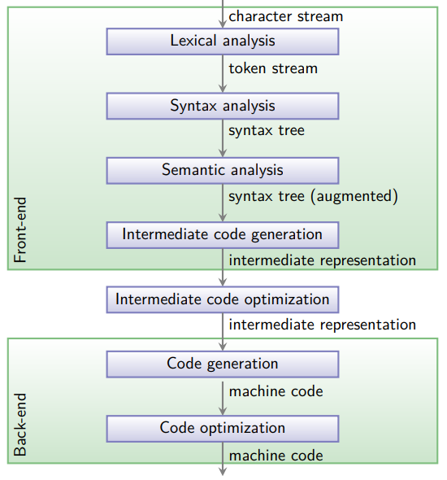

# vsopcompiler
INFO0085 - Compilers - VSOP Compiler Project

## Detailed Structure of a Compiler

## Lexical Analysis
### Role
Transforms the source code into a stream of tokens.
### How does it work ?
It reads the characters of the source code and groups them into meaningful sequences called tokens.
Tokens can be keywords, identifiers, literals, operators, etc.
It simplifies the syntax analysis by reducing the complexity of the source code into a sequence of standardized tokens.
### Theory
Input : Character Stream
Output : Token Stream
- [ -> ]

## Syntax Analysis
### Role
Checks the token stream against the language's grammar and generates a syntax tree.
This process checks that the program is well-formed according to the rules of the VSOP programming language.
### How does it work ?
It uses the tokens to build a tree structure that represents the grammatical structure of the code, often referred to as a parse tree or abstract syntax tree (AST)

## Semantic Analysis
### Role
Ensures that the syntax tree follows the language's semantics, which are the rules that give meaning to the structure.
This step ensures that the meaning of the code is valid, for example, adding an integer to a string directly is usually not semantically valid.
### How does it work ?
It may involve checking variable declarations, type checking, and other rules to make sure that the operations in the code make sense.
