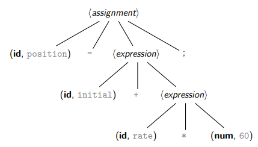
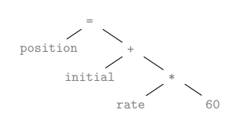
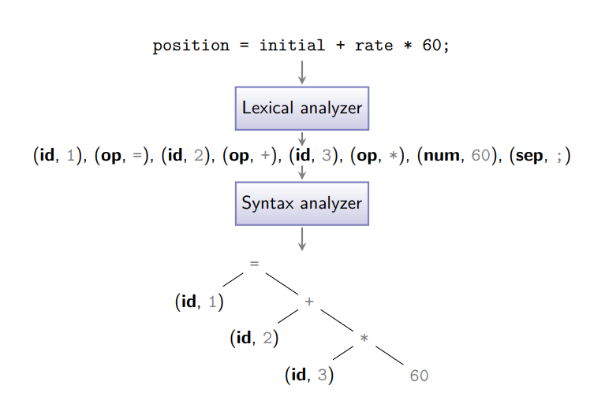
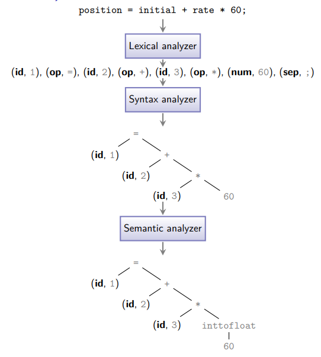

# vsopcompiler
INFO0085 - Compilers - VSOP Compiler Project

## Detailed Structure of a Compiler

# Table of Contents
1. [Lexical Analysis](#Lexical-Analysis)
2. [Syntax Analysis](#Syntax-Analysis)
3. [Semantic Analysis](#semantic-analysis)

## Lexical Analysis
Also known as Scanning \
Input : Character Stream \
Output : Token Stream
- [ ] Lexical analyzer groups characters into meaningful sequences called lexemes
-> E.g. string "position = initial + rate * 60;" is split into seven lexemes : position, =, initial, +, rate, *, 60, ;
-> Scanning ignores non-significant blanks and comments
- [ ] For each lexeme, the lexical analyzer produces as output a token, that is, a pair of the form (token-name, attribute-value)
-> The produced tokens for above string are
(id, 1), (op, =), (id, 2), (op, +), (id, 3), (op, *), (num, 60), (sep, \;) with the symbol table, dictionary structure (in modern compilers, the table is not built anymore during lexical analysis but in a separate phase) :

| Symbol | Attribute Value              | ... |
|-----------|-------------------|-------------------------------------|
| 1 | position   | ... |
| 2 | initial   | ... |
| 3 | rate       | ... |
| ... | ... | ... |

- [ ] Each token is defined by a regular expression
-> Example : \
    < letter > ::= A-Z | a-z \
    < digit > ::= 0-9 \
    < identifier > ::= < letter > ( < letter > | < digit >)*

- [ ] Lexical analysis is implemented by 
    1. building a non deterministic finite automaton from all token regular expressions
    2. eliminating non determinism, building a deterministic finite automaton
    3. simplifying the automaton, building a minimal (a.k.a. canonical) deterministic finite automaton

- [ ] There exist software to easily build lexical analyzers from regular expressions (Examples ; lex, flex, ...)

## Syntax Analysis
Also known as Parsing \
Input : Token Stream \
Output : Syntax Tree
- [ ] Parsing groups of tokens into grammatical phrases.
- [ ] The result is represented in a parse tree, i.e. a tree-like representation of the grammatical structure of the token stream.
- [ ] Example :
    -> Grammar for assignment statement : \
    < assignment > ::= id = < expression > \
    < expression > ::= num | id | < expression > + < expression > \
    
- [ ] The parse tree is often simplified into a (abstract) syntax tree \
    
- [ ] This tree is used as a base structure for all subsequent phases
- [ ] Actually, internally, the tree is rather a datastructure that can be visited recursively
- [ ] On parsing algorithms :
    -> Languages are defined by context-free grammars
    -> Parse and syntax trees constructed by building automatically a (kind of) pushdown automaton from the grammar
    -> Typically, these algorithms only work for a (large) subclass of context-free grammars

- [ ] Result : \
    

## Semantic Analysis
Input : Syntax Tree \
Output : (Augmented) Syntax Tree
- [ ] Context-free grammars are unable to capture some of the language constraints (e.g. non local/context-dependent relations)
- [ ] Semantic/contextual analysis checks the source program for semantic consistency with the language definition :
    -> a variable can not be used without having been defined
    -> the same variable can not be defined twice
    -> the number of arguments of a function should match its definition
    -> one can not multiply a number and a string
Such constraints are not captured by context-free grammars
- [ ] Semantic analysis also carries out type checking 
    -> each operator should have matching operands
    -> in some cases, implicit type conversion (a.k.a. coercion) might occur (e.g., for numbers)
- [ ] Example: position = initial + rate * 60
    -> If the variables position, initial, and rate are defined as floating-point variables and 60 was as an integer, it may be converted into a floating-point number

- [ ] Result : \
    